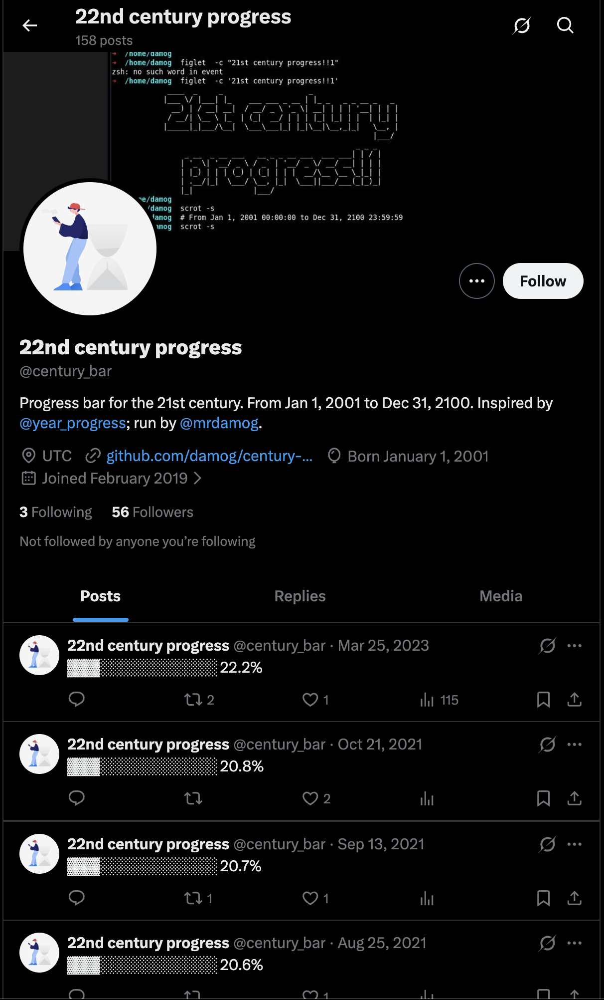

# 21st Century Progress Bar

A real-time progress bar tracking how far humanity has made it through the 21st century.

**🌐 Live Site: [damog.github.io/century-progress](https://damog.github.io/century-progress/)**

---

## The Journey

### 2019: The Twitter Bot Era

This project started in February 2019, inspired by the amazing [@year_progress](https://twitter.com/year_progress) Twitter account built by [Filip Hráček](https://filiph.net/). I wanted to take it further—a progress bar for the *entire* 21st century. Because who knows if humanity will make it to 2100, or if Twitter will even exist, or if the Internet as we know it will still be around?

The original implementation was an **AWS Lambda function** that tweeted to [@century_bar](https://twitter.com/century_bar) every ~8.7 hours (roughly when the 3rd decimal place would change). It was a fun way to learn about:

- AWS Lambda and the serverless paradigm (I hadn't touched AWS since 2009!)
- Python 2.x (yes, this was 2019 and I was still learning Python 2)
- The Twitter API via [TweetPony](https://github.com/Mezgrman/TweetPony)

The Lambda ran on AWS's free tier, costing essentially nothing. The dream was for it to tweet **forever**—well, until December 31st, 2100 at 23:59:59. I'd be 116 years old. I may have plans that day.

Here's the [@century_bar](https://twitter.com/century_bar) account, frozen in time at 22.2% (March 2023):



### 2023: Twitter's API Paywall

Then Elon Musk happened.

In February 2023, Twitter killed free API access. What was once free now costs $100/month minimum. The [@century_bar](https://twitter.com/century_bar) bot went silent—a casualty of the platform's new direction.

The irony isn't lost on me: when I started this project, I wondered if Twitter would still exist by 2100. Turns out the question was more immediate than expected.

### 2025: GitHub Pages Revival

Rather than pay $100/month to tweet a progress bar, I rebuilt the project as a **static website** hosted for free on GitHub Pages. No backend needed—the calculation happens entirely in your browser using JavaScript.

The new version is actually *better*:
- **Real-time updates** (every second, not every 8 hours)
- **8 decimal places** of precision (the last digit ticks ~3 times per second!)
- **Visual progress bar** with 100 bars × 100 cells (10,000 total cells!)
- **Time elapsed/remaining** broken down to years, months, days, hours, minutes, seconds
- **Local timezone support**
- **Zero cost**, forever

---

## Why 2001–2100?

The 21st century officially began on **January 1, 2001** (not 2000) because the Gregorian calendar has no "year zero"—it goes directly from 1 BC to 1 AD. Thus:
- 1st century: years 1–100
- 2nd century: years 101–200
- ...
- 21st century: years **2001–2100**

[Wikipedia: 21st century](https://en.wikipedia.org/wiki/21st_century)

---

## Project Structure

```
century-progress/
├── docs/                    # GitHub Pages static site
│   └── index.html           # The live website
├── src/                     # Legacy AWS Lambda (Python 2 + TweetPony)
│   └── lambda_function.py   # Original Twitter bot
├── src-modern/              # Modern AWS Lambda (Python 3 + Tweepy)
│   ├── lambda_function.py   # Updated for Twitter API v2
│   └── requirements.txt     # Dependencies
└── README.md
```

### The Static Site (`docs/`)

Pure client-side JavaScript. Features:
- 100 progress bars, each containing a 10×10 grid (100 cells)
- Each cell = 0.01% of the century
- 8 decimal precision (8th decimal updates every ~316ms)
- Runs entirely in your browser

### Legacy Lambda (`src/`)

The original 2019 implementation:
- Python 2.x (AWS deprecated this runtime in 2021)
- Uses TweetPony library (last updated 2015)
- Bundled dependencies (~2MB)

### Modern Lambda (`src-modern/`)

A cleaned-up Python 3.11+ version:
- Uses [Tweepy](https://www.tweepy.org/) for Twitter API v2
- Proper UTC timezone handling
- Single dependency (~200KB with tweepy)

**Note:** This requires a paid Twitter API subscription ($100/month) to actually post tweets.

---

## Deployment

### GitHub Pages (Recommended)

1. Fork this repo
2. Go to Settings → Pages
3. Source: Deploy from branch
4. Branch: `master` (or `main`), Folder: `/docs`
5. Your site will be live at `https://yourusername.github.io/century-progress/`

### AWS Lambda (if you really want to tweet)

```bash
cd src-modern
pip install -r requirements.txt -t .
zip -r ../lambda.zip .
# Upload to AWS Lambda (Python 3.11+ runtime)
# Set environment variables: CONSUMER_KEY, CONSUMER_SECRET, ACCESS_TOKEN_KEY, ACCESS_TOKEN_SECRET, TWEET
```

---

## The Math

- **Total duration:** 36,524 days (100 years, accounting for 24 leap years; 2100 is NOT a leap year)
- **Total seconds:** 3,155,673,600
- **Update frequencies:**
  - 8th decimal (0.00000001%): ~316 milliseconds
  - 7th decimal (0.0000001%): ~3.16 seconds
  - 6th decimal (0.000001%): ~31.6 seconds
  - 5th decimal (0.00001%): ~5 minutes 16 seconds
  - 4th decimal (0.0001%): ~52 minutes 36 seconds  
  - 3rd decimal (0.001%): ~8 hours 46 minutes
  - 2nd decimal (0.01%): ~3.65 days
  - 1st decimal (0.1%): ~36.5 days

---

## License

[WTFPL](http://www.wtfpl.net/about/) — Do What The Fuck You Want To Public License.

---

## Author

**David Moreno**

- Website: [damog.net](https://damog.net)
- GitHub: [@damog](https://github.com/damog)

---

*Here's to hoping we make it to 2100. See you at 100.00000000%* 🎉
